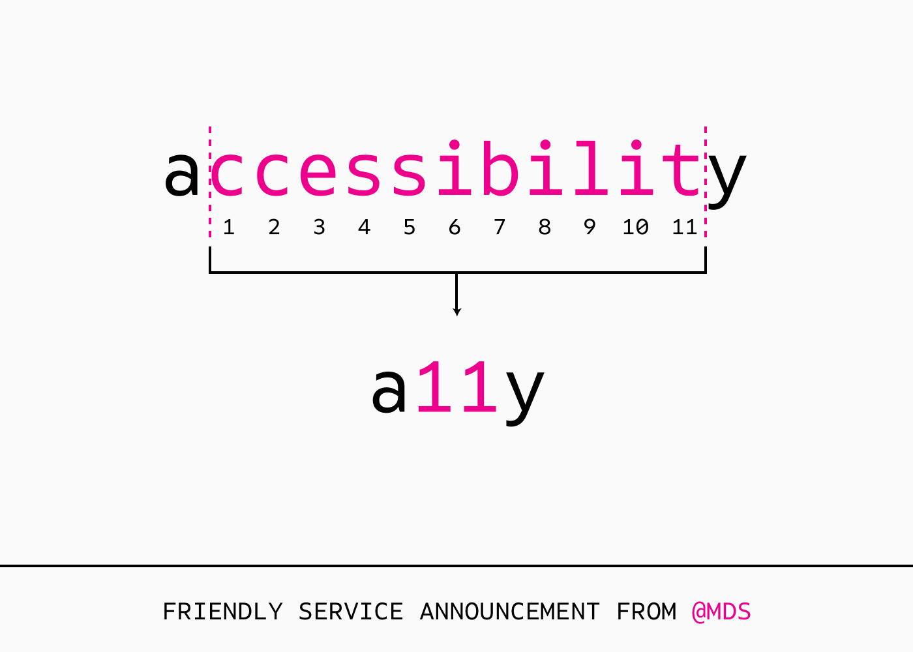
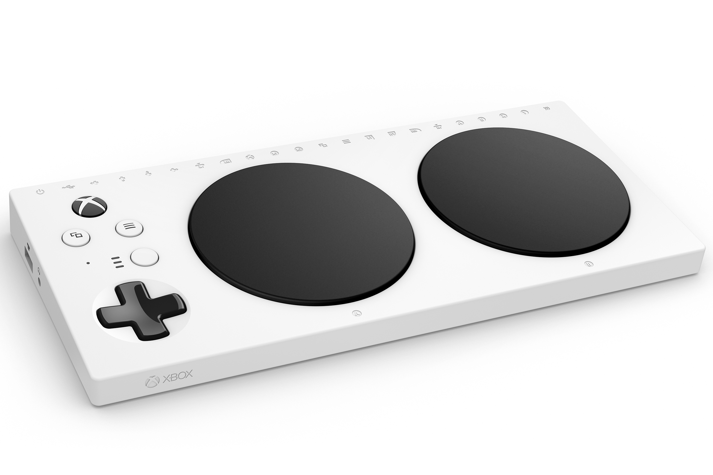
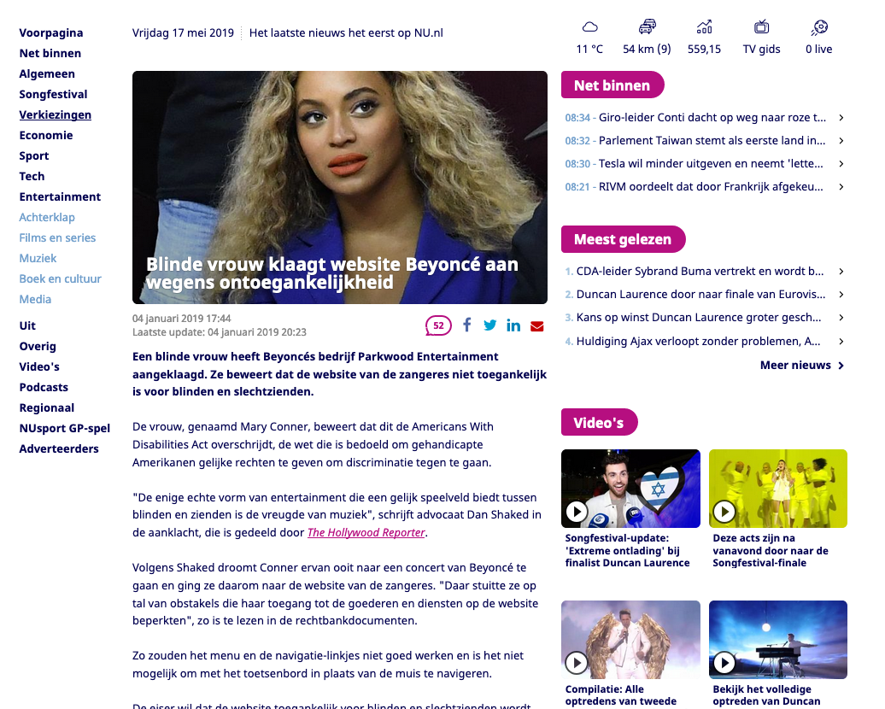
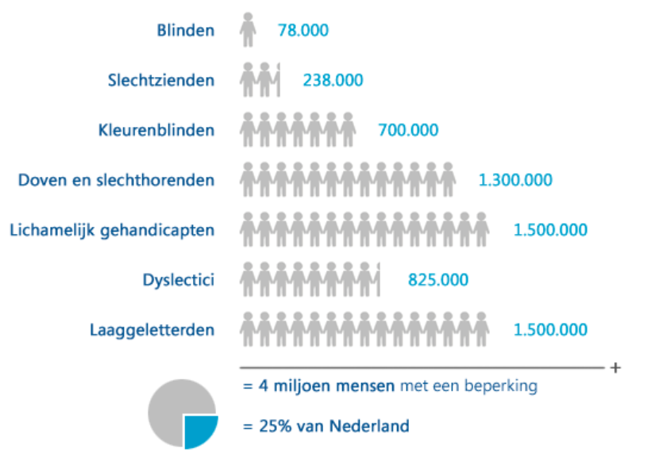
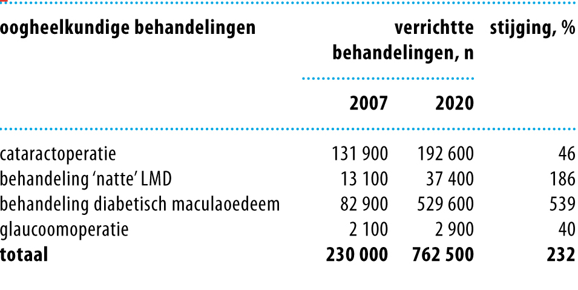

# Algemeen

## Over mij

- Projecten
- Certification

## Wat betekent A11y



## Niews

### Microsoft lanceert a11y controller


[](https://www.youtube.com/watch?v=9fcK19CAjWM)

### Beyonce is aangeklaagd



## Misvattingen

- Screenreaders ondersteunen geen javascript
- Het kost veel tijd
- Je doet het alleen voor blinden- of slechtzienden
- Je moet de aria tags uit je hoofd leren

## Doel van de presentatie

- Overtuigen van het nut
- Enthousiast maken voor a11y
- Dat a11y nu een standaard wordt voor componenten
- Doel is niet dat we vanaf nu a11y sites op gaan leveren of gaan refactoren. Daar moet de klant voor betalen. Het is makkelijker om een nieuwe site om te zetten, dan een bestaande site. Zelfde geldt voor
  seo en responsive design.

## Nut en noodzaak

- Site laagdrempeling maken
- Gebruikersgroep verbreden
- Fix for one, solve for many
- Semantisch beter opgezet
- Site is futureproof (controllers, voice assistants)

## POUR

- Perceivable
  ondertiteling, contrast, screenreader
- Operable
  toetsenboard, stem
- Understandable
  schrijf b1 niveau: korte zinnen, geen bijzinnen
- Robust
  oude apparaten

## Doelgroep

### Algemeen



### Slechtzienden



## Use cases

### Toetsenbord

- Mensen met fysieke beperkingen
- Controller op de browser
- Lege batterijen op de muis
- Poweruser

### Juist contrastwaarden

- Slechtzienden
- Gebruikers met slechte beeldschermen
- Smartphone gebruiken in de felle zon

### Videos met captions

- Doven/slechhorenden
- Drukke trein
- Op kantoor, tussen het deployen door

## Wat zijn screenreaders

> Een schermlezer of (naar het Engels) screenreader is een extern softwareprogramma dat de tekst van andere software kan voorlezen, en soms de software met stem kan besturen.

- MacOs en iOs: VoiceOver
- Google: Voice assistent
- Windows: Narrator
- Overig: JAWS, NVDA, Supernova

## Cetificering

- Drempelvrij
- A/AA/AAA
- Alles moet voldoen aan de standaarden, inclusief subdomeinen, scripts en PDFs

## Verantwoordelijkheid

- Design/Ux
- Frontend
- Content

# Richtlijnen

## Javascript

- JavaScript is toegestaan, mits geen toegankelijkheidsproblemen worden veroorzaakt.
- Verander nooit de rol van een element en zorg dat alles toetsenbord toegankelijk blijft.

## Basistaal (en taalwisselingen)

> SC 3.1.1 (A) en 3.1.2 (AA)

- De basistaal van de webpagina is aangegeven (lang en/of xml:lang binnen <html>).
- De taalwisselingen op de webpagina zijn aangegeven.

## Paginatitel

> SC 2.4.2 (A)

- De webpagina heeft een titel die het doel of het onderwerp beschrijft.
- De paginatitel is uniek binnen de website.

## Nadruk

> SC 1.3.1 (A)

- Woorden met nadruk zijn opgemaakt met `<strong>` of `<em>` (en niet met `<b>`, `<i>` of CSS).
- De elementen `<strong>` en `<em>` zijn niet gebruikt om koppen mee te maken.

## Frames en iframes

> SC 2.4.1, 4.1.2 (A)

- Iframes hebben een title attribuut die de inhoud van het iframe beschrijven.

## Tekstalternatief voor afbeeldingen

> SC 1.1.1 (A)

- Functionele afbeeldingen hebben een duidelijk beschrijvend tekstueel alternatief (alt tekst).
- Decoratieve afbeeldingen hebben een leeg alt attribuut of zijn via CSS geplaatst.
- Als alternatief niet in alt attribuut past: langere beschrijving rondom afbeelding of ernaar verwijzen.
- Afbeeldingen die als link gebruikt worden, dienen altijd tekstueel alternatief te hebben.
- CSS-afbeeldingen: alternatief mag buiten beeld geplaatst (nooit display:none / visibility:hidden).

## Afbeeldingen van tekst

> SC 1.4.5 (AA)

- Zet geen tekst op afbeeldingen, maar plaats tekst met HTML en style deze met CSS. _Uitzondering: essentiële afbeeldingen met tekst zoals logo's._

## Captcha

> SC 1.1.1 (A)

- Er is zeker één alternatieve Captcha voor andere zintuigen beschikbaar.
- Er is een tekstalternatief met doel en instructie over waar de alternatieve Captcha te vinden is.

## Kleurgebruik

> SC 1.3.1 en 1.4.1 (A)

- Kleur wordt niet als enige middel gebruikt om informatie over te brengen.
- Kleur wordt niet als enige middel gebruikt om een actie aan te geven.
- Kleur wordt niet als enige middel gebruikt om tot een reactie op te roepen.
- Kleur wordt niet als enige middel gebruikt om een visueel element te onderscheiden.

## Contrast

> SC 1.4.3 (AA)

- Het contrast van normale tekst en afbeeldingen van tekst is 4,5:1.
- Het contrast van grote tekst (18pt of 14pt dikgedrukt) en afbeeldingen van grote tekst is 3:1.

## Herschalen van tekst

> SC 1.4.4 (AA)

- Tekst kan tot 200% vergroot worden zonder verlies van info en functionaliteit.

## Style sheets

> SC 1.3.1(A)

- Zorg voor een betekenisvolle leesvolgorde (controle: zet style sheets uit).

## Audio zonder beeld of video zonder audio

> SC 1.2.1 (A)

- Bied een uitgeschreven tekst van de audio.
- Bied een uitgeschreven tekst van de video of een audiodescriptie.

## Video

> SC 1.2.2, 1.2.3 (A), 1.2.4 en 1.2.5 (AA)

- Bied audiodescriptie bij video's.
- Bied ondertiteling bij video's.
- Er zijn enkele uitzonderingen, waarbij dit niet ## hoeft (zie SC 1.2.1 t/m 1.2.3).

## Automatisch startend geluid

> SC 1.4.2 (A)

- Automatisch afspelende audio (>3 seconden) kan gepauzeerd of uitgezet worden.

## Voldoende tijd

> SC 2.2.1 (A)

- Bied de bezoekers voldoende tijd om de content te lezen en te bedienen.
- Vermijd auto refresh of sessies die verlopen of bied mogelijkheid dit aan te passen/verlengen.

## Bewegende content

> SC 2.2.2 (A)

- Bewegende, knipperende of actualiserende content (>5 seconden) kan gepauzeerd worden. Dit dient ook met het toetsenbord te kunnen.

## Flitsen

> SC 2.3.1 (A)

- Webpagina's bevatten geen snelle flitsen die epilepsie kunnen veroorzaken.

## Grote wijzigingen

> SC 3.2.1 en 3.2.2 (A)

- Voorkom grote wijzigingen (refresh, pop-up, etc.) bij focus of verandering van een invoerveld.

## Toetsenbord toegankelijkheid

> SC 2.1.1, 2.1.2 en 2.4.3 (A)

- Alle functionaliteit op de webpagina is bedienbaar met het toetsenbord.
- Bied een logische tabvolgorde door de webpagina.
- Tabfocus is zichtbaar (fout als er gebruik is gemaakt van `outline:none / outline:0` in CSS).

## Navigatie en links

> SC 2.4.1, 2.4.4, 3.2.1, 3.2.2 (A), 2.4.5, 3.2.3 en 3.2.4 (AA)

- Bied zo duidelijk mogelijke linkteksten.
- Onderdelen van de website navigatie worden consistent op de zelfde plek geplaatst. Onderdelen met een bepaalde functie hebben consistent dezelfde naam.
- Gebruik skiplinks en zorg dat deze zichtbaar zijn bij tabfocus.

## Relaties binnen formulieren

> SC 1.1.1, 1.3.1, 3.3.2 en 4.1.2 (A) en 2.4.6 (AA)

### Label

- Het `<label>`element is gebruikt om tekstlabels met formulier-invoervelden te associëren.

  - velden moeten altijd een label hebben (geassocieerd met for/id)
  - bij onzichtbare labels, gebruik liever een sr-only class dan aria-label
  - gebruik nooit placeholders als label, die worden niet gelezen door screenreader

```html
<label for="lastname">Achternaam</label>
<input type="text" name="lastname" id="lastname" />
```

---

- Het title attribuut is gebruikt als geen ruimte was voor een visueel tekstlabel.
- De `<fieldset>` en `<legend>` elementen zijn gebruikt voor het groeperen van bedieningselementen.
- Gebruik `<fieldset>` en `<legend>` altijd voor een groep radiobuttons of checkboxen.
- Bied goed beschrijvende labels en plaats belangrijke instructie binnen het geassocieerde label.

## Fout identificatie, foutsuggestie en preventie

> SC 3.3.1 (A), SC 3.3.3 en 3.3.4 (AA)

- Als formulier niet verstuurt: tekstueel duidelijk de fout beschrijven en waar deze zich bevindt. Geef ten alle tijden een suggestie ter verbetering van de fout.
- Foutpreventie bij formulieren met belangrijke gegevens: mogelijkheid tot annulering of controle.

# Code

## Css

### Screenreader only

```css
.sr-only {
  position: absolute;
  width: 1px;
  height: 1px;
  padding: 0;
  margin: -1px;
  overflow: hidden;
  clip: rect(0, 0, 0, 0);
  border: 0;
}
```

### Focus

```css
*:focus {
  outline: 1px dotted var(--black);
}
```

- Gebruik altijd een focus state, niet alleen voor keyboardgebruikers.
- Alleen interactieve elementen mogen een focusstate hebben

### Media queries

```css
@media screen and (prefers-reduced-motion: reduce) {
  * {
    animation: none !important;
    transition: none !important;
  }
}

@media screen and (inverted-colors: inverted) {
  img {
    filter: invert(100%);
  }
}
```

### Placeholders

```css
::-webkit-input-placeholder {
  /* Chrome/Opera/Safari */
  color: var(--gray-lighter);
  font-style: italic;
}
::-moz-placeholder {
  /* Firefox 19+ */
  color: var(--gray-lighter);
  font-style: italic;
}
:-ms-input-placeholder {
  /* IE 10+ */
  color: var(--gray-lighter);
  font-style: italic;
}
:-moz-placeholder {
  /* Firefox 18- */
  color: var(--gray-lighter);
  font-style: italic;
}
```

- goed gebruik om placeholder italic te maken

# Indept components

- tabs
- kaarten
- carousel
- modal
- menu

# Todo

- verschil A/AA/AAA

# Opdracht

- Contrast in text
- lees meer links
- onclick op item
- geen tekst in social links
-

# Afsluiter

- benader mij voor vragen
- goed gevoel bij?
